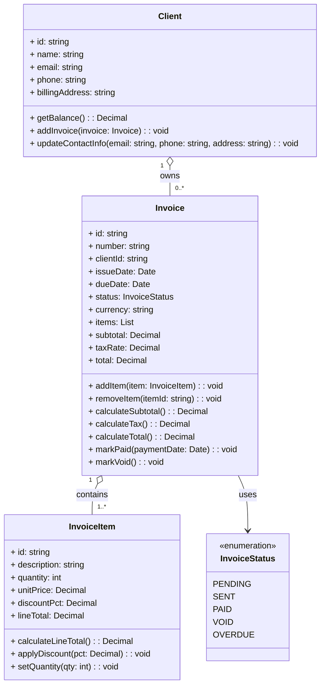

## UML Diagram Request
```markdown
step 1: Produce a UML diagram for an invoicing system with classes for Invoice, Client, and InvoiceItem. 
- Include attributes and methods for each class. 
- Output in Markdown format.
step 2: In the same folder generate an SVG file representing the UML diagram.
```

---

## UML Diagram (Mermaid)


